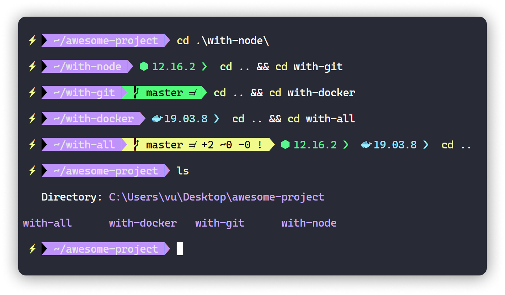

# Dracula theme for [Powershell](https://github.com/JanDeDobbeleer/oh-my-posh)

> A dracula theme for [Oh-my-posh](https://github.com/JanDeDobbeleer/oh-my-posh).



## Install

**Step 1**: You need to to install [Oh-my-posh](https://github.com/JanDeDobbeleer/oh-my-posh) first.

**Step 2**: Download Dracula.psm1 and move this file to :

```powershell
%USERPROFILE%\Documents\PowerShell\Modules\oh-my-posh\<Version>\Themes
```

`Version` Depending on your version

**Step 3**: Set theme in your profile

```powershell
Set-Theme Dracula
```

My profile configurations:

```powershell
Import-Module posh-git
Import-Module oh-my-posh
Import-Module PSReadLine

Set-Theme Dracula

If (-Not (Test-Path Variable:PSise)) {
    Import-Module Get-ChildItemColor
    Set-Alias l Get-ChildItem -option AllScope
    Set-Alias ls Get-ChildItemColorFormatWide -option AllScope
}
Set-PSReadlineKeyHandler -Key Tab -Function Complete
```

## Terminal & Font

- Terminal (with hyper-dracula) : [Hyper](https://hyper.is/) or Windows Terminal, Cmder, ConEMU ...

- Font : [CaskaydiaCove Nerd Font](https://www.nerdfonts.com/font-downloads)

## Author

[Vu Thanh Le](https://github.com/thanhvule0310)
